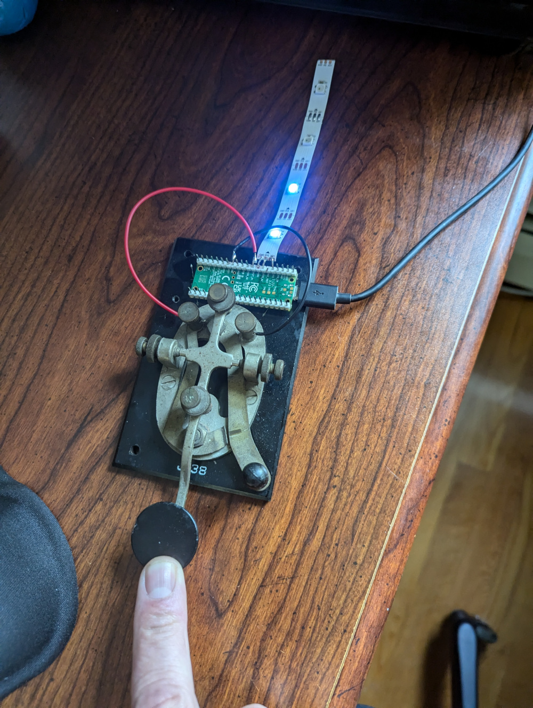
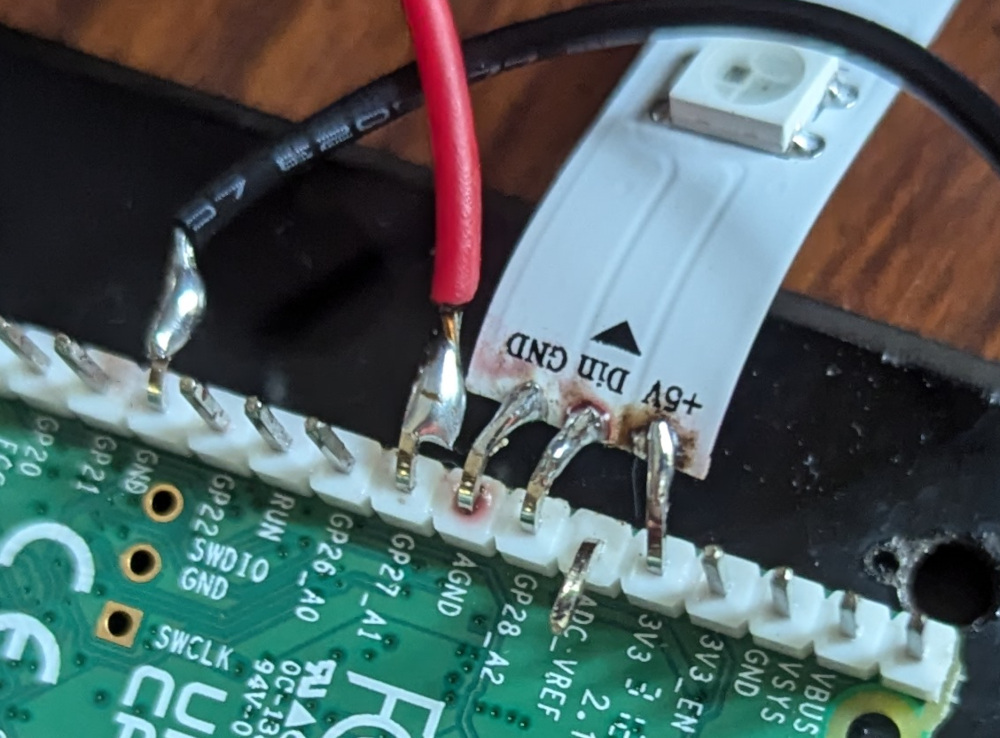

# Morse Pixel

## Button + NeoPixels + MQTT

Simple control of neopixel lights using MQTT protocol. Get the device online and witness folks turning their lights on and off on your device.

* Button publishes MQTT message
* Light 1 responds to button clicks
* Light 2 responds to MQTT messages

Not included: A broker, we lean on [HiveMQ's public broker](https://broker.hivemq.com). So anyone can see your messages, and subscribe to anyone elses.

# Raspberry PI Pico + Morse Code key

## BOM (Bill of Materials)
* Pico PI
* NeoPixels
* Switch
* Wires

## Assembly

1. Bent the pins on the PI to reduce required wiring
1. Wires can go to any kind of (normally open) button/switch

## Provision software to Pico
1. [Flash micropython firmware](https://www.raspberrypi.com/documentation/microcontrollers/micropython.html#drag-and-drop-micropython) (plug it in and drag/drop [this file](https://micropython.org/download/rp2-pico/rp2-pico-latest.uf2) to it) : After doing this I see the device as /dev/ttyACM2 on my system (ubuntu 22), yours will probably be different
1. Install `umqtt` on pico (multple ways to do this... here is one)
    1. `ampy -p /dev/ttyACM2 put install_libraries.py main.py`
    1. Turn it off and back on again
1. Upload code using [apmy](https://learn.adafruit.com/micropython-basics-load-files-and-run-code/install-ampy?gad_source=1&gclid=CjwKCAjwpbi4BhByEiwAMC8JnTC3BM3D70_gn5eDZCc3SvTwVVQfdWQqOMKFVBi8L9MW3avLxDvhkxoCFVsQAvD_BwE)
    1. `ampy -p /dev/ttyACM2 put wifi.py`
    1. `ampy -p /dev/ttyACM2 put main.py`
    1. Turn it off and back on again
1. Press your button
